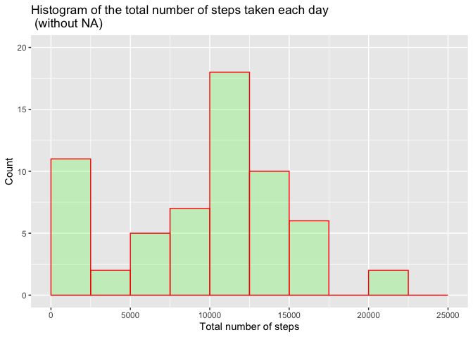
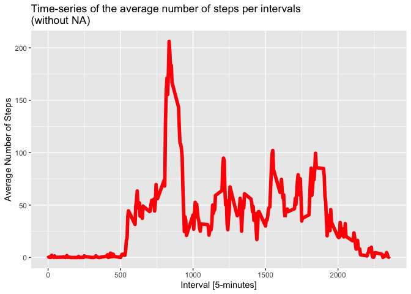
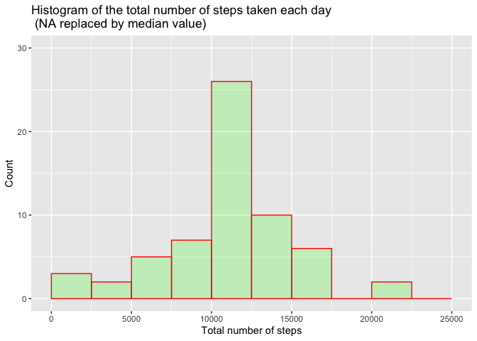
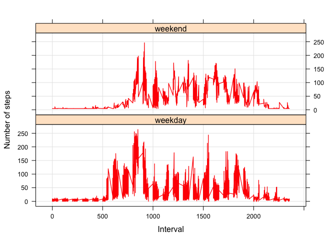

# Reproducible Research: Peer Assessment 1
## Gaston Pezzuchi
### Tuesday, 28 July 2020

## Preliminaries

1. *We will start by setting the working directory and clearing the workspace*

```r
# Setting working directory (change accordingly)
setwd("/Volumes/HP x755w/Coursera/Reproducible/Project1")

# Clear the workspace
rm(list=ls())
```

2. *We assume the data has been downloaded to the working directory*
   The required .zip file is named: **"repdata_data_activity.zip"**
   First we need to unzip the data


```r
if (!file.exists('activity.csv')) {
  unzip(zipfile = "repdata_data_activity.zip")
}
```

3. *We now need to load the raw activity data and process the data*

     a. Load the raw data


```r
# Load the raw activity data
activity_raw <- read.csv("activity.csv", stringsAsFactors=FALSE)
```
     
     b. Let's see the data:


```r
dim(activity_raw)
```

```
## [1] 17568     3
```

```r
head(activity_raw)
```

```
##   steps       date interval
## 1    NA 2012-10-01        0
## 2    NA 2012-10-01        5
## 3    NA 2012-10-01       10
## 4    NA 2012-10-01       15
## 5    NA 2012-10-01       20
## 6    NA 2012-10-01       25
```

   There are 17568 observations and 3 variables, yet, the date variable is of *"character"* type instead of *"date"*


```r
typeof(activity_raw$date)
```

```
## [1] "character"
```

Hence we need now to:

      c. Transform the date attribute to an actual date type


```r
activity_raw$date <- as.POSIXct(activity_raw$date, format="%Y-%m-%d")
typeof(activity_raw$date)
```

```
## [1] "double"
```

      d. We also need to compute the weekdays from this date


```r
activity_raw <- data.frame(date=activity_raw$date, 
                           weekday=tolower(weekdays(activity_raw$date)), 
                           steps=activity_raw$steps, 
                           interval=activity_raw$interval)
```

      e. Also we need to calculate the type of day (weekday / weekend)


```r
activity_raw <- cbind(activity_raw, 
                      daytype=ifelse(activity_raw$weekday == "saturday" | 
                                     activity_raw$weekday == "sunday", "weekend", 
                                     "weekday"))
```

      f. We now have all the required fields for the final dataframe


```r
activity <- data.frame(date=activity_raw$date, 
                       weekday=activity_raw$weekday, 
                       daytype=activity_raw$daytype, 
                       interval=activity_raw$interval,
                       steps=activity_raw$steps)
# Let's see a bit of the dataframe
head(activity)
```

```
##         date weekday daytype interval steps
## 1 2012-10-01  monday weekday        0    NA
## 2 2012-10-01  monday weekday        5    NA
## 3 2012-10-01  monday weekday       10    NA
## 4 2012-10-01  monday weekday       15    NA
## 5 2012-10-01  monday weekday       20    NA
## 6 2012-10-01  monday weekday       25    NA
```

```r
# To keep tidy the workspace we need to delete the activity_raw dataframe we will no longer use
rm(activity_raw)
```

-------------------------------

## What is the mean total number of steps taken per day?
(For this part of the assignment, you can ignore the missing values in the dataset).

 - Calculate the total number of steps taken per day
 - If you do not understand the difference between a histogram and a barplot, research the difference between them. Make a histogram of the total number of steps taken each day
 - Calculate and report the mean and median of the total number of steps taken per day

      a. Let's Calculate the total number of steps taken each day (we will remove the NA values)


```r
sum_dat <- aggregate(activity$steps, by=list(activity$date), FUN=sum, na.rm=TRUE)

# Rename the attributes
names(sum_dat) <- c("date", "total")
```

         We can now take a closer look to the newly created dataframe
      

```r
dim(sum_dat)
```

```
## [1] 61  2
```

```r
head(sum_dat)
```

```
##         date total
## 1 2012-10-01     0
## 2 2012-10-02   126
## 3 2012-10-03 11352
## 4 2012-10-04 12116
## 5 2012-10-05 13294
## 6 2012-10-06 15420
```


      b. Histogram of the total number of steps taken each day


```r
# We will use ggplot2 to calculate the histogram of the total number of steps each day
library(ggplot2)
ggplot(data=sum_dat, aes(total)) + 
  geom_histogram(breaks=seq(from=0, to=25000, by=2500),
                            col="red",
                            fill="green", 
                            alpha = .2) + 
  labs(title="Histogram of the total number of steps taken each day \n (without NA)", x="Total number of steps", y="Count") + 
  ylim(c(0,20))
```

<!-- -->


      c. We now need to calculate and report the mean and the median of the total number of steps taken per day


```r
mean(sum_dat$total)
```

```
## [1] 9354.23
```

```r
median(sum_dat$total)
```

```
## [1] 10395
```

   So as, we can see, we get a mean of **9354.23** and a median of **10395**
   
-------------------------------

## What is the average daily activity pattern?

   - Make a time series plot (*type = "l"*) of the 5-minute interval (x-axis) and the average number of steps taken, averaged across all days (y-axis)
   - Which 5-minute interval, on average across all the days in the dataset, contains the maximum number of steps?

   First, we need the average number of steps taken, hence:
   

```r
# Since que do not neeed the sum_dat dataframe we will remove it from the
rm(sum_dat)

# We need to calculate the means of steps accross all days for each interval
mean_dat <- aggregate(activity$steps, 
                      by=list(activity$interval), 
                      FUN=mean, 
                      na.rm=TRUE)

# Change the attributes
names(mean_dat) <- c("interval", "mean")

# Chek the dataframe
dim(mean_dat)
```

```
## [1] 288   2
```

```r
head(mean_dat)
```

```
##   interval      mean
## 1        0 1.7169811
## 2        5 0.3396226
## 3       10 0.1320755
## 4       15 0.1509434
## 5       20 0.0754717
## 6       25 2.0943396
```


   Now we are ready to create the time series plot:

   

```r
library(ggplot2)
ggplot(data = mean_dat, aes(x = interval, y = mean)) +
  geom_line(col="red", lwd=2) +
  labs(title="Time-series of the average number of steps per intervals\n(without NA)", x="Interval [5-minutes]", y="Average Number of Steps")
```

<!-- -->


   And, now we can answer *"Which 5-minute interval, on average across all the days in the dataset, contains the maximum number of steps?*

      a. First we need to find the actual index of the maximum value of the mean


```r
max_index <- which(mean_dat$mean == max(mean_dat$mean))
max_index
```

```
## [1] 104
```

      b. We can now find the value of the 5-minute interval for that index


```r
max_interval <- mean_dat[max_index, 1]
max_interval
```

```
## [1] 835
```

```r
# Once obtained the answer, we can remove the variables and the dataframe 
rm(max_index, max_interval, mean_dat)
```

   As we can see, the 5-minute interval that contains the maximum of steps (on average across all days) is **835**.

--------------------------

## Imputing missing values

   (Note that there are a number of days/intervals where there are missing values (coded as  *NA*). The presence of missing days may introduce bias into some calculations or summaries of the data). 
   
   We are required to:
   
      - Calculate and report the total number of missing values in the dataset (i.e. the total number of rows with NAs)
      - Devise a strategy for filling in all of the missing values in the dataset. The strategy does not need to be sophisticated. For example, you could use the mean/median for that day, or the mean for that 5-minute interval, etc.
      - Create a new dataset that is equal to the original dataset but with the missing data filled in.
      -  Make a histogram of the total number of steps taken each day and Calculate and report the **mean** and **median** total number of steps taken per day. 
      -  Do these values differ from the estimates from the first part of the assignment? 
      -  What is the impact of imputing missing data on the estimates of the total daily number of steps?


   a. To calculate the total number of NAs in the dataset, we can use:


```r
NA_total <- sum(is.na(activity$steps))
NA_total
```

```
## [1] 2304
```

```r
rm(NA_total) #we do not need this variable anymore
```
      
      So, the total number of NAs is: **2304**

   b. For the Missing Data Imputation strategy, there are different options. Actually to decide how to handle missing data, it is helpful to know why they are missing. That is we need to consider the *“missingness mechanism”*. There are usually four main situations: (1) Missingness completely at random, (2) Missingness at random. (3) Missingness that depends on unobserved predictors and (4) Missingness that depends on the missing value itself. 
   In this case we will use a simple strategy of imputation, assigning the median to the NAs (we could have used the mean, but it will be more susceptible to extreme values in the distribution:
   


```r
# Locate the NA positions (index)
na_pos <- which(is.na(activity$steps))

# Create a vector of medians
med_vec <- rep(median(activity$steps, na.rm=TRUE), times=length(na_pos))

# Let's check the values of the vector
head(med_vec)
```

```
## [1] 0 0 0 0 0 0
```

   As we can see, we have a vector of entire 0's as the median, so if we replace the NAs with this value we will get the same median and mean values as in question 1 (incidentally we will obtain the same histogram). *Hence, we switch to replace the NAs by the mean*, the procedure is the same as above:


```r
# Create a vector of means
mean_vec <- rep(mean(activity$steps, na.rm=TRUE), times=length(na_pos))

# Let's check the values of the mean vector
head(mean_vec)
```

```
## [1] 37.3826 37.3826 37.3826 37.3826 37.3826 37.3826
```

   Now, we can proceed with the imputation proceure, using the mean.


   c. Since we will replace the NAs with the meaan we will create a *"transformed"* dataframe 
   

```r
# Replace the NAs by the medians
activity[na_pos, "steps"] <- mean_vec

# Since we no longer need the mean_vec, med_vec or the na_pos, we can remove them from the workspace
rm(med_vec, mean_vec, na_pos)

# We can now look at the transformed dataframe
dim(activity)
```

```
## [1] 17568     5
```

```r
head(activity)
```

```
##         date weekday daytype interval   steps
## 1 2012-10-01  monday weekday        0 37.3826
## 2 2012-10-01  monday weekday        5 37.3826
## 3 2012-10-01  monday weekday       10 37.3826
## 4 2012-10-01  monday weekday       15 37.3826
## 5 2012-10-01  monday weekday       20 37.3826
## 6 2012-10-01  monday weekday       25 37.3826
```

   d. (1) We need to create a histogram of the total number of steps taken each day


```r
# First we need to calculate the total number of steps each day (we no longer have the NAs)
sum_dat <- aggregate(activity$steps, by=list(activity$date), FUN=sum)

# Rename the attributes
names(sum_dat) <- c("date", "total")

# We will once again use ggplot2 to calculate the histogram of the total number of steps each day (this time with the NAs replaced by the median value)
library(ggplot2)
ggplot(data=sum_dat, aes(total)) + 
  geom_histogram(breaks=seq(from=0, to=25000, by=2500),
                            col="red",
                            fill="green", 
                            alpha = .2) + 
  labs(title="Histogram of the total number of steps taken each day \n (NA replaced by median value)", x="Total number of steps", y="Count") + 
  ylim(c(0,30))
```

<!-- -->

   d. (2) The required mean and median are calculated using:
   

```r
mean(sum_dat$total)
```

```
## [1] 10766.19
```

```r
median(sum_dat$total)
```

```
## [1] 10766.19
```

```r
# since we no longer need it we can remove sum_dat from the worskpace
rm(sum_dat)
```

   So we can see that we get a mean of **10766** and a median of **10766**. Remember our previous calculation of these values was **9354.23** and **10395** for the mean and median when we just remove the NAs.

-----------------------
## Are there differences in activity patterns between weekdays and weekends?
(For this part the weekdays() function may be of some help here).

   - Use the dataset with the filled-in missing values for this part.

   - Create a new factor variable in the dataset with two levels – “weekday” and “weekend” indicating whether a given date is a weekday or weekend day.
  
   - Make a panel plot containing a time series plot (type = "l") of the 5-minute interval (x-axis) and the average number of steps taken, averaged across all weekday days or weekend days (y-axis). 
  (See the README file in the GitHub repository to see an example of what this plot should look like using simulated data)
  
  We can now procede with this last part:

   a. Actually we have already created the two required factors at the begining of this document:


```r
head(activity)
```

```
##         date weekday daytype interval   steps
## 1 2012-10-01  monday weekday        0 37.3826
## 2 2012-10-01  monday weekday        5 37.3826
## 3 2012-10-01  monday weekday       10 37.3826
## 4 2012-10-01  monday weekday       15 37.3826
## 5 2012-10-01  monday weekday       20 37.3826
## 6 2012-10-01  monday weekday       25 37.3826
```

```r
dim(activity)
```

```
## [1] 17568     5
```

   b. So, we are ready to create the required plot now:
   

```r
library(lattice)  # perfect for panel plots.

# Calculate the mean number of steps by all daytype variable
mean_dat <- aggregate(activity$steps, 
                      by=list(activity$daytype, 
                              activity$weekday, activity$interval), mean)

# Rename the attributes
names(mean_dat) <- c("daytype", "weekday", "interval", "mean")

# Plot
xyplot(mean ~ interval | daytype, mean_dat, 
       type="l", 
       lwd=1.3,
       col="red",
       grid = TRUE,
       xlab="Interval", 
       ylab="Number of steps", 
       layout=c(1,2))
```

<!-- -->

   Lastly we can now clear the entire workspace
   

```r
rm(list=ls())
```

  **This completes the requirements of the asssignment.**

